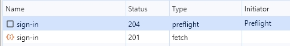
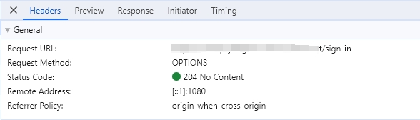

# Post发送两次请求

最近公众号和掘金上都经常看见推送“为什么post发送两次请求?”  
这不就是预检么？

先看具体表现

省流一句话：当出现跨域且为非简单请求，就会出现Preflight，也就是两次请求。

## 什么是跨域

跨域：跨源资源共享（CORS）策略

当页面请求资源时，出现：协议、域名、端口 任意一个不一样，就会出现跨域。

### 为什么有跨域这个问题

跨域问题主要是出于安全考虑。为防止恶意网站读取或修改另一个网站的数据，现代 Web 浏览器实施了同源策略（Same-Origin Policy）。这项策略默认阻止网页向不同源的服务器发起读取请求。

### 出现跨域问题如何解决

一般解决如下：

CORS（Cross-Origin Resource Sharing）：最常用的解决方案。服务器设置特定的 HTTP 头部，如 Access-Control-Allow-Origin，来允许特定的外部域访问其资源。

JSONP（JSON with Padding）：较老的技术，利用 `<script>` 标签不受同源策略限制的特点来绕过跨域限制。但只能用于 GET 请求。

代理服务器：通过在同源的服务器上设置代理，将请求转发到其他域的服务器上。

文档域设置（document.domain）：仅适用于二级域名相同而子域名不同的情况，通过设置 document.domain 来允许相互访问。

## 什么是简单请求、什么是非简单请求

### 简单请求

同时满足以下条件：

- 请求方法：使用以下方法之一：
    - GET
    - HEAD
    - POST

- HTTP 头部：除了浏览器自动设置的头部（如 User-Agent, Content-Language 等）和在 CORS 安全清单中的头部（如 Accept, Content-Type, Content-Language, Last-Event-ID），没有使用其他头部。特别地，Content-Type 必须是以下之一：
    - text/plain
    - multipart/form-data
    - application/x-www-form-urlencoded

- 无事件监听器：请求没有使用事件监听器注册事件。

- 无可读流对象：请求没有使用 ReadableStream 对象。

- 无 XMLHttpRequestUpload 对象：请求没有使用 XMLHttpRequestUpload 对象，或者有，但未注册任何事件监听器。

### 非简单请求

不是简单请求当然就是非简单请求了，通常如下：

- 使用了 PUT、DELETE、CONNECT、OPTIONS、TRACE、PATCH 等 HTTP 方法。
发送了除简单请求所允许之外的 HTTP 头部。
- Content-Type 是 application/json、text/xml 或其他非简单请求类型。
在 XMLHttpRequest 中注册了事件监听器。

## 什么是Preflight 请求？

Preflight 请求是一种自动发起的 HTTP OPTIONS 请求，它发生在实际的跨源请求之前。浏览器使用它来确定实际请求是否安全且被服务器允许。这主要用于含有某些特定特征的请求，比如：

- 使用除 GET、HEAD 或 POST 以外的 HTTP 方法。
- POST 请求的 Content-Type 不是 application/x-www-form-urlencoded、multipart/form-data 或 text/plain。
- 请求中包含自定义的 headers。

## Preflight请求的处理

- 自动发送：当满足上述条件时，浏览器会自动发起一个 OPTIONS 请求到服务器。

- 服务器响应：服务器需要正确响应这个 OPTIONS 请求，声明哪些源、哪些 HTTP 方法和头部是被允许的。

- 实际请求：只有当 preflight 响应表明实际请求是被允许的，浏览器才会发送实际的请求。
