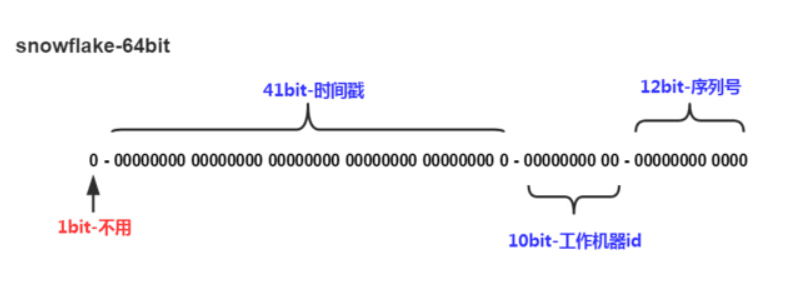

# 分布式微服务

## 概念

### CAP

一般分布式系统，要么是 CP，要么是 AP。

- **一致性(Consistency)**：每次读取都会返回最新写入的数据。
- **可用性(Availability)**：每个请求都能得到一个响应，无论响应成功或失败。
- **分区容错性(Partition tolerance)**：系统能够持续提供服务，即使出现了网络分区。

_之所以不能同时满足这三个要素，是因为在发生网络分区（网络故障导致节点间无法通信）的情况下，要保证一致性就可能需要牺牲可用性（因为某些操作可能需要等待或失败以保持数据一致），反之亦然。_

在选择适用场景时：

- 一致性优先：适用于对数据准确性要求极高的场景，如银行系统。
- 可用性优先：适用于对服务响应时间和稳定性要求较高的场景，如社交媒体。
- 分区容错性：是分布式系统必须要满足的，因此在设计时需要考虑如何在一致性和可用性之间做权衡。

### 雪花算法

雪花算法（Snowflake Algorithm）是由Twitter开源的一种分布式唯一ID生成算法。

核心思想: 是将一个64位的长整型ID划分成多个部分，每个部分表示不同的含义，主要包括时间戳、机器ID、数据中心ID和序列号。通过组合这些部分，雪花算法可以在分布式系统中生成唯一的、有序的ID。

- 第1位占用1bit，其值始终是0，可看做是符号位不使用。
- 第2位开始的41位是时间戳，41-bit位可表示2^41个数，每个数代表毫秒，那么雪花算法可用的时间年限是(1L\<\<41)/(1000L360024*365)=69 年的时间。
- 中间的10-bit位可表示机器数，即2^10 = 1024台机器，但是一般情况下我们不会部署这么台机器。如果我们对IDC（互联网数据中心）有需求，还可以将 10-bit 分 5-bit 给 IDC，分5-bit给工作机器。这样就可以表示32个IDC，每个IDC下可以有32台机器，具体的划分可以根据自身需求定义。
- 最后12-bit位是自增序列，可表示2^12 = 4096个数。

这样的划分之后相当于**在一毫秒一个数据中心的一台机器上可产生4096个有序的不重复的ID**。但是我们 IDC 和机器数肯定不止一个，所以毫秒内能生成的有序ID数是翻倍的。

#### 雪花算法存在的缺点

- 依赖于服务器时间：雪花算法生成ID的过程中需要使用机器的时钟信息。如果机器的时钟发生了调整或者时钟不同步，可能会导致生成的ID重复或者不连续。这尤其在服务器时钟回拨时更为明显，可能会生成重复的ID。
- 扩展性不够好：雪花算法使用位运算来表示各个部分的信息，因此在需要扩展ID长度或增加ID的组成部分时，需要重新设计算法并修改代码，这可能会带来一些麻烦。
- 高并发下生成ID的效率问题：由于雪花算法需要保证生成的ID是唯一的，因此在高并发的情况下，可能会出现性能瓶颈，影响ID的生成效率。
- 可能超过某些语言的数值精度：雪花算法产生的长整数的精度可能超过某些语言（如JavaScript）能表达的精度，这会导致获取的ID与雪花算法算出来的ID不一致，进而影响数据的操作。
