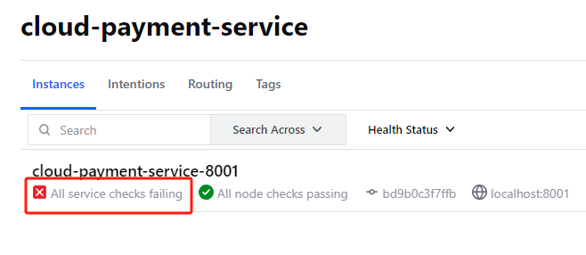
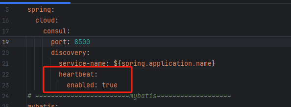

# Consul

## 问题解决

### 启动微服务后，始终是显示红叉

出现`All service checks failing`  
经查询可能是Consul的心跳机制没有打开，所以健康检查报红

开启配置`spring.cloud.consul.discovery.heartbeat.enabled=true`

配置后重启服务，红叉消失，服务正常

[错误处理参考](https://blog.csdn.net/sgrrmswtvt/article/details/125243045)