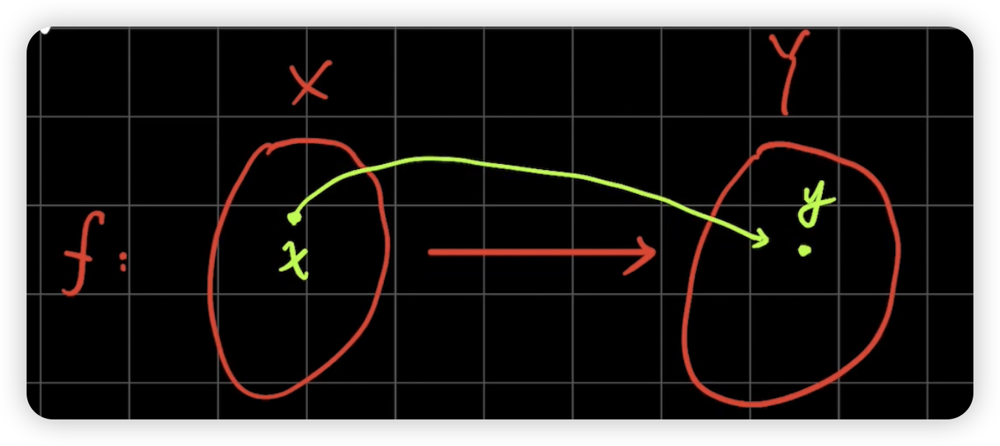

# 第一章 函数与映射

## 映射

定义 1 :

设有非空集合 $X$、$Y$ 及由 $X$ 到 $Y$ 的对应法则 $f$， 若对每个 $x \in X$，存在唯一的 $y \in Y$ 按 $f$ 与之对应，则称分为 $X$ 到 $Y$ 的映射。记作：  
$f : X \to Y$   (或 $y = f(x), x \to X$)

- $X$: $f$的定义域，记作$D_f$.  
- $f(x)=\{y|y=f(x), x \to D_f\}$,$f$的值域记作 $R_f$